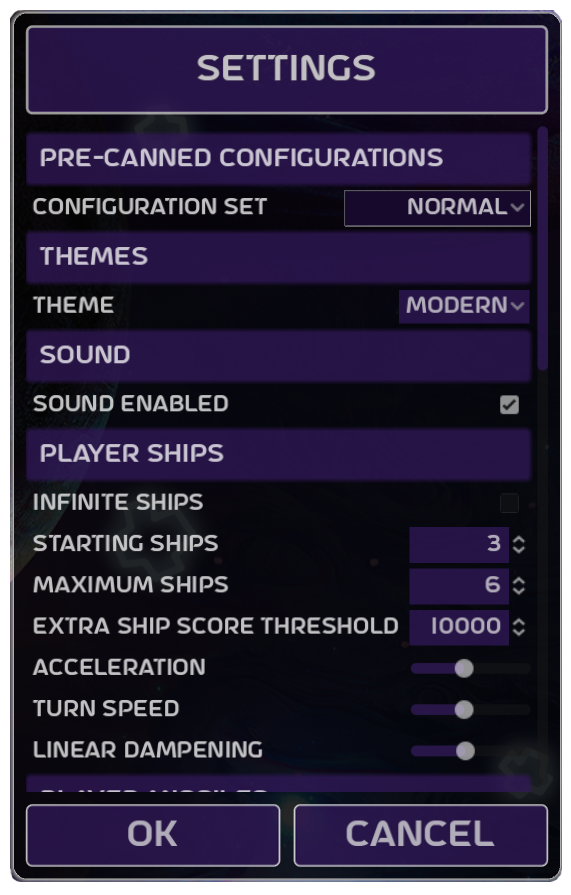

# How to Play

Game play is as per the classic arcade game.  

You control a ship which is surrounded by a field of asteroids.  Your ship may be rotated and accelerated forwards by applying thrust.  It is equipped with a blaster which is used to destroy asteroids.

There are three sizes of asteroids. *Large* asteroids split into two *medium* asteroids when hit, in turn these split into two *small* asteroids which themselves explode into dust when hit.

Periodically an enemy saucer will appear and attempt to destroy your ship.  There are two types of saucer, the larger slow moving variety which shoots randomly and the smaller swifter variety which directly targets your ship.

As a last resort you may make a hyperspace jump.  This is fraught with danger, your ship could spontaneously explode or you might rematerialize inside an asteroid.

Sometimes destroying an asteroid causes a *Power Up* to spawn, pilot your ship over the *Power Up* to collect it.

Of course your ship is destroyed should you collide with an asteroid or a saucer or be hit by a saucer's missile.

Once all asteroids have been destroyed a new, more difficult, asteroid field spawns.

## Controls

The game is controlled with the keyboard.

* *Start Game* - 1
* *Configuration Settings* - C
* *Help* - H
* *Quit Game* - Escape
* "Pause/UnPause* - P

### Game Play

* *Rotate CW* - S
* *Rotate ACW* - A
* *Fire* - Left Mouse Button
* *Thrust* - Right Mouse Button
* *Hyperspace* - Space Bar

# Scoring

* *Large Asteroid* - 20 points
* *Medium Asteroid* - 50 points
* *Small Asteroid* - 100 points
* *Large Saucer* - 200 points
* *Small Saucer* - 1000 points

# Configuration

Asteroids is highly customizable to suit your game play preferences.

Hit the *C* key in-game to enter the configuration dialogue.

At a macro level there are five pre-canned configurations which adjust all settings via a single selection.

Four apply the *modern* user interface at progressively harder levels of difficulty and the fifth (*Classic*) models the original arcade machine in look and game-play. 

Should you wish to tweak further all of the following may be configured individually.

## Theme

* *Theme* - Select a user interface theme, either a modern look or one which reflects
the original arcade game.

## Sound

* *Sound* - Enable or disable sound effects.

## Player Ships

* *Infinite Ships* - Select infinite ships to never lose a life!
* *Starting Ships* - The number of ships at the beginning of a new game.
* *Maximum Ships* - The maximum number of ships that may be earned.
* *Extra Ship Score Threshold* - The score threshold at which new ships are earned.
* *Acceleration* - How quickly your ship accelerates.
* *Turn Speed* - How quickly your ship turns.
* *Linear Dampening* - How quickly your ships slows when not thrusting.

## Player Missiles

* *Maximum* - Maximum number of player missiles on the screen at once.
* *Speed* - Player missile speed, relative to ship velocity.
* *Lifespan* - Lifespan of player missiles.
  
## Asteroids

* *Rotation Enabled* - Enable or disable asteroid rotation.  Asteroids did not rotate in the original arcade game.
* *Starting Quantity* - The number of asteroids at the beginning of a new game.
* *Maximum Starting Quantity* - The number of asteroids at the start of each new sheet increases until this limit is reached.
* *Minimum Speed* - The minimum speed at which asteroids travel.
* *Maximum Speed* - The maximum speed at which asteroids travel.
* *Gravity Enabled* - Enable or disable gravitational pull of asteroids.
* *Gravitational Constant* - How hard gravity sucks!

## Large Saucer

* *Enabled* - Enable or disable the large saucer ship.
* *Speed* - Speed of the large saucer.
* *Spawn Frequency* - How often the large saucer spawns.
* *Maximum Missiles* - Maximum number of large saucer missiles on the screen at once.
* *Missile Speed* - Speed of large saucer missiles.
* *Missile Lifespan* - Lifespan of large saucer missiles.

## Small Saucer

* *Enabled* - Enable or disable the small saucer ship.
* *Speed* - Speed of the small saucer.
* *Spawn Frequency* - How often the small saucer spawns.
* *Maximum Missiles* - Maximum number of small saucer missiles on the screen at once.
* *Missile Speed* - Speed of small saucer missiles.
* *Missile Lifespan* - Lifespan of small saucer missiles.